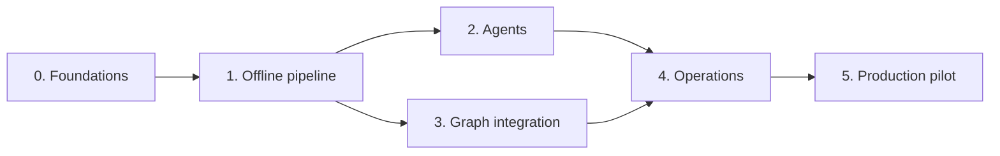

# Techary Pulse: development plan

**Status:** agreed
**Owner:** Ben Nicholls
**Date:** 25 September 2026

This document describes how the Techary Pulse minimum viable solution (MVS), set out in the [design and architecture document](techary-pulse-design.md), is built. It covers the engineering principles, technology choices, repository structure, development approach and delivery phases. Behaviour, and every decision about it, is in the design. It is written for the engineers building Pulse.

## Principles

Pulse follows three coding principles. Where they pull in different directions, KISS wins.

- **KISS (keep it simple).** Build the simplest thing that meets the design. Add no speculative features, and introduce an interface only where a second implementation exists; a test fake counts.
- **DRY (don't repeat yourself).** Every rule, value and definition has one authoritative place in the code. Write logic once and call it wherever it is needed, and derive anything that can be derived, such as a schema from its model, instead of keeping a second copy.
- **SOLID.** Each module has one job. New agents and check rules are added without editing the runner. The fake and real mailboxes are interchangeable and pass the same tests. Interfaces contain only what the pipeline uses, and the pipeline receives its dependencies rather than creating them.

## Technology choices

The design fixes the shape of the system: a Python package providing the `pulse` command, packaged as a container. The choices below fill in the rest.

| Area | Choice | Reason |
| --- | --- | --- |
| Language | Python 3.14, moving to 3.15 once its dependencies support it | Latest stable release. |
| Dependencies | uv, with `pyproject.toml` and a committed `uv.lock` | The lockfile records the exact versions tested, so the container runs what the tests ran. |
| Version policy | Latest versions of every package, with minimum versions only and no upper limits; upgrade with `uv lock --upgrade`, then run the checks, at the start of each phase | Keeps Pulse current, with each upgrade checked before it is committed. |
| Lint and format | Ruff | One tool for linting, import ordering and formatting. |
| Type checking | mypy in strict mode | Catches drift between the pipeline, the real mailbox and the fake. |
| Tests | pytest, with parameterised cases for the check rules | One test style, no extra dependency. |
| Models and configuration | Pydantic, with PyYAML `safe_load` | One set of models validates `config.yaml`, agent output and the run manifest. |
| Agents | `pydantic-ai-slim[openai]`, used for its agent and model layer only, in native output mode | Runs each agent with typed output and validation retry against the gateway's OpenAI-compatible endpoint, independent of the provider behind it; its test models stand in for the gateway in automated tests. Tested against the dev gateway in phase 0: native mode sends no tools, output types limited to schema features every major provider supports are accepted, Pydantic AI validates each reply, and requests go only to the gateway. Set `PYDANTIC_AI_NO_BANNER=1`, and use `httpx2` clients. |
| Entra ID token | Microsoft Authentication Library (MSAL) for Python | Maintained implementation of the certificate client assertion. |
| Microsoft Graph calls | Direct REST calls through httpx | Pulse uses five operations, so a software development kit (SDK) adds more than it saves. |
| Rendering | Jinja2 with autoescaping on | Escapes model output and email-derived strings by default. |
| Scheduling | A cron library that supports IANA time zones, inside `pulse schedule` | Computes the next run in `Europe/London` correctly across daylight saving changes. |
| Logging | Standard library `logging` with a JSON formatter | Structured logs without another dependency. |
| Command-line interface | `argparse` | Two commands and two options do not need a framework. |
| Container | `python:3.14-slim`, running as a non-root user | Small image with no build tools. |

## Repository structure

```text
techary-pulse/
├── README.md                        What Pulse is, how to run it, the mailbox permissions it needs
├── pyproject.toml                   Package metadata, dependencies, tool settings
├── uv.lock                          Locked dependency versions
├── .python-version                  Python version for uv, matching the container
├── Dockerfile
├── .dockerignore
├── .gitignore
├── .claude/settings.json            Claude Code permissions (deny reading secrets)
├── config/
│   ├── config.example.yaml          Production-shaped example, placeholders only
│   └── config.dev.example.yaml      Dev tenant example, placeholders only
├── src/pulse/
│   ├── __main__.py
│   ├── cli.py                       pulse run, pulse schedule
│   ├── config.py                    Configuration model, loader and recipient validation
│   ├── models.py                    Messages, extract records, items, drafts, check results
│   ├── errors.py
│   ├── mail.py                      Mailbox interface and GraphMailbox
│   ├── log.py                       JSON log formatter
│   ├── schedule.py                  Cron loop, signal handling
│   ├── agents/
│   │   ├── base.py                  Agent base class
│   │   ├── runner.py                Runs any agent through Pydantic AI
│   │   ├── extractor/
│   │   │   ├── agent.py             The Extractor class
│   │   │   └── instructions.md
│   │   ├── consolidator/
│   │   ├── drafter/
│   │   └── judge/
│   ├── pipeline/
│   │   ├── runner.py                Steps 1 to 9 in order
│   │   ├── rules.py                 Pre-filter, exclusions and section order
│   │   ├── check.py
│   │   └── render.py                Newsletter and review section, with autoescaping
│   ├── state.py                     Lock, run manifest and artefacts, retention
│   └── templates/
│       └── newsletter.html.j2
├── tests/
│   ├── conftest.py
│   ├── support.py                   FakeMailbox, stand-in models, message builders
│   ├── corpus/                      Synthetic emails
│   ├── golden/                      Rendered reviewer email for comparison
│   ├── unit/
│   └── pipeline/                    Full runs against the fake mailbox, crash recovery
└── docs/
    ├── techary-pulse-design.md
    └── development-plan.md
```

The mailbox has three parts, only one of which ships in production:

- `Mailbox`, in `mail.py`, is a short interface listing what the pipeline needs from a mailbox: list the inbox, move a message and send an email.
- `GraphMailbox`, also in `mail.py`, implements it by calling Microsoft Graph. The same code serves the dev tenant and production; only the configuration differs.
- `FakeMailbox`, in `tests/`, implements it with messages held in memory and sends nothing. Tests use it to run the whole pipeline in milliseconds without a tenant, and to simulate failures a real tenant will not produce on demand, such as a move failing after the send.

Each agent is a self-contained folder holding its class and instructions. The class derives from `Agent` in `agents/base.py` and declares the agent's name, which is also its key in `llm.models`, its input and output types, its settings and its permitted tools, which are always none. It implements `build_message`, which turns its input into the message sent to the model, and can override `check_output` for checks beyond the schema. `agents/runner.py` runs any agent through Pydantic AI, so adding an agent never changes the runner, and the base class only describes what an agent is.

The repository never contains real email content, a real `config.yaml`, certificates, keys or run artefacts. The certificate is kept outside the repository folder, and `.gitignore` excludes `*.pem`, `*.pfx`, `.env`, `config.yaml` and `runs/`.

## Commands

| Command | Purpose |
| --- | --- |
| `uv sync` | Install dependencies |
| `uv run ruff format` | Format code |
| `uv run ruff check` | Lint |
| `uv run mypy src tests` | Type check |
| `uv run pytest` | Run tests; tests marked `live` are excluded by default |
| `docker build -t techary-pulse .` | Build the container image |

Run format, lint, type check and tests before every commit.

## Development approach

**Pipeline shape first.** Phase 1 wires all nine steps end to end against the fake mailbox and Pydantic AI test models before any real integration exists. Later phases replace the stand-ins with real services, so the pipeline runs throughout.

**Test first for deterministic code.** The pre-filter, selection rules, check rules, recipient validation, manifest handling and rendering are written test first. A bug fix starts with a failing test.

**Agent testing.** Automated tests replace each agent's model with a Pydantic AI stand-in returning JSON set by the test, checking wiring, validation, retry and failure handling on every commit. Draft quality is judged by reviewers, as the design intends.

**Environments.** Automated tests use stand-ins and no network. Where configuration, credentials and the certificate live on the server and in local development is set out in the README. The dev tenant and dev gateway are used for integration and manual end-to-end runs. The production mailbox is used only in phase 5.

**Run it as documented.** Passing tests is not enough to finish a phase. Each phase ends with Pulse run the way the README documents, with a real configuration, so that anything the README leaves out shows up before the phase closes.

**The design is the source of truth.** A change in behaviour updates the design document in the same change, and a change of technology updates the technology choices table in this plan.

## Delivery phases

Development runs in six phases, each ending with exit criteria that can be checked. Phases 2 and 3 are independent once phase 1 has fixed the interfaces, so they can run in parallel.



*Figure 1: Delivery phases. Phases 2 and 3 can run in parallel.*

### Phase 0: foundations

**Goal:** a repository in which code can be written, tested and reviewed to the agreed standard.

Scope:

- scaffold the package, `pyproject.toml`, `.gitignore` and `.claude/settings.json`;
- build the configuration model, the example configurations, JSON logging and the command-line skeleton;
- write the Dockerfile and the README, including the mailbox permissions Pulse needs;
- test Pydantic AI against the dev gateway: one agent called through agentgateway's OpenAI-compatible endpoint, confirming structured output works with the gateway's model names, no tools are sent and no telemetry leaves the server, with the result recorded in the technology choices table.

Exit criteria:

- format, lint, type check and tests pass;
- `pulse --help` runs in the built container;
- the example configuration loads, and a configuration with a reviewer outside `allowed_recipient_domains` fails at start-up;
- the gateway test result is recorded; if Pydantic AI had failed it, the runner would have been built on the official `openai` SDK instead;
- following the README's local setup with a real `config.yaml` and `.env`, `uv run --env-file .env pulse run --dry-run` loads the configuration.

### Phase 1: offline pipeline

**Goal:** all nine steps run end to end against the fake mailbox and Pydantic AI test models, with every deterministic rule in the design built and tested.

Scope, taken section by section from the design. Each item is built and covered by tests.

- **Configuration:** configuration fails to load if an agent has no `llm.models` entry or an entry names no agent.
- **Architecture:** `Mailbox` (list the inbox, move a message, send an email) and `FakeMailbox`; the `Agent` base class and the runner, using Pydantic AI in native output mode with no tools, calling `llm.base_url` in the OpenAI-compatible format with the credential from the environment variable named in `llm.api_key_env`; the four agents with placeholder instructions.
- **Step 1, lock and resume:** the exclusive lock on `pulse.lock` in `run_artefacts_dir`, with a second concurrent run exiting at once; completing incomplete moves from the latest manifest that is not a dry run; deleting run artefacts older than `retention_days`.
- **Step 2, snapshot:** recording every inbox message ID in a new manifest, and processing only those messages.
- **Step 3, pre-filter:** the sender taken from `from`; rejection by sender domain, `allowed_senders`, any disallowed sensitivity label in `msip_labels`, `Auto-Submitted` and `X-Auto-Response-Suppress` headers, and `uniqueBody` shorter than `min_body_chars`.
- **Step 4, extract:** one extractor call per cleaned email, run in parallel; excluding records that are not updates, are unclear, have no matching section or carry a sensitivity flag.
- **Step 5, consolidate:** one consolidator call; checking that every returned source ID came from the input and that every input record appears in exactly one item; adding each item's sender names.
- **Step 6, draft:** one drafter call on the consolidated items, with no raw email content.
- **Step 7, check:** every code check in the design's check section; the judge call on the intro and each entry; one regeneration with the failure reasons; sending a second failing draft with the failures listed first.
- **Step 8, render and send:** the subject from `subject_template` and the run date; the Techary-branded template, with the headline under `headline_title`, then the intro, then sections in config order, omitting empty sections; the review section's six parts in order; escaping all model output and email-derived text; sending to `reviewers` with `replyTo` set to `reviewers`; recording the send in the manifest.
- **Step 9, move messages:** moving to `Processed` and `Rejected`, creating either folder if absent, only after the send succeeds; marking the manifest complete.
- **Empty weeks:** no newsletter; rejected messages still moved; everything else left in the inbox.
- **Model steps:** retrying an invalid response once, and failing the run on a second invalid response.
- **Failure handling:** each row of the design's failure table except Graph throttling, including a gateway error and a `SIGTERM` at a step boundary.
- **Run artefacts:** a dated directory per run holding the fetched messages, intermediate JSON, draft attempts, check results, the rendered reviewer email and the manifest, with file mode `0600` and directory mode `0700`; `--dry-run` sending and moving nothing, with its manifest marked as a dry run.
- **Testing:** the synthetic corpus covering every case listed in the design's testing section.

Exit criteria:

- a pipeline test runs the corpus through all nine steps and produces the reviewer email and a complete manifest;
- a failure injected at each step boundary, and a `SIGTERM`, leave the mailbox and manifest as the design's failure table describes, and the next run recovers;
- the rendered newsletter and review section are agreed as golden files;
- every command in the README still works as documented with a real configuration.

### Phase 2: agents

**Goal:** the four agents produce reviewable drafts from the corpus through the dev gateway.

Scope, taken from the design's model steps section:

- **Extractor:** instructions covering the extract record's fields and their values, the configured categories and their definitions, extracting only facts stated in the message, and treating the email, given in a delimited block, as data rather than instructions.
- **Consolidator:** instructions for merging records describing the same news, writing the headline as one short line from the consolidated items, and choosing one category where merged records differ.
- **Drafter:** instructions applying every drafting rule in the design, including the tone rules, all held in `agents/drafter/instructions.md`.
- **Judge:** instructions for returning, for the intro and each entry, whether its text is supported by the facts of the consolidated items.
- **Live test:** a `live` test that runs the corpus through the agents against the dev gateway and saves the reviewer email.

Exit criteria:

- a reviewer has read the drafts produced from the corpus and confirmed them;
- the `live` test runs by following the README, with a real configuration.

### Phase 3: Graph integration

**Goal:** the same pipeline runs against the dev tenant through `GraphMailbox`.

Scope, taken from the design's Microsoft Graph integration section:

- **Authentication:** the client credentials flow through MSAL with the certificate at `graph.certificate_path`, calculating and logging the thumbprint at start-up.
- **Operations:** the five operations in the design's operations table, each request sending `Prefer: IdType="ImmutableId"`, list requests also sending `Prefer: outlook.body-content-type="text"`, following `@odata.nextLink` and sorting in code.
- **Throttling:** on HTTP 429, waiting for `Retry-After` and retrying up to `graph.max_retries`.
- **Dev tenant:** at least one Microsoft Purview sensitivity label published, which needs a licence that includes sensitivity labels, with its label ID in the dev `allowed_sensitivity_labels`; confirming that Graph returns `msip_labels` and `hasAttachments` for real dev tenant messages.
- **Tests:** unit tests against mocked HTTP responses, including throttling and server errors; `FakeMailbox` and `GraphMailbox` passing the same interface tests; manual dry runs and real runs in the dev tenant.

Exit criteria:

- a real run in the dev tenant sends the draft to the test reviewer and moves every snapshot message to the correct folder;
- the interface tests pass against both mailboxes;
- the real run is made by following the README's local setup and commands, not by a test script.

### Phase 4: operations

**Goal:** Pulse runs unattended in its container and fails safely and visibly.

Scope, taken from the design's architecture, failure handling and packaging sections:

- **Schedule:** `pulse schedule` calling `pulse run` on `schedule.cron` in `schedule.timezone`, as the container entrypoint.
- **Signals:** on `SIGTERM`, stopping at the next step boundary with the manifest recording progress.
- **Alerts:** a failed run sending an alert to `operator_alerts`; if the alert cannot be sent, logging the error and exiting with status 1.
- **Container:** running as a non-root user, with run artefacts readable only by that user; reading `config.yaml` and the certificate from mounted paths, the gateway credential from the environment, writing artefacts to a mounted volume and logging to standard output.
- **README:** deployment to the server.

Exit criteria:

- the container runs unattended in the dev environment through at least two scheduled runs, including one forced failure and one `SIGTERM` mid-run, and both recover;
- the operator alert arrives for the forced failure;
- the container is set up and run by following the README's host requirements and running instructions.

### Phase 5: production pilot

**Goal:** Pulse produces real weekly drafts for reviewers from the production mailbox.

Scope:

- deployment to the closed server with production configuration, once the production mailbox and its permissions are in place as the README describes;
- weekly runs sending drafts to reviewers;
- a decision on the scope after the MVS, such as sending to all staff.

Exit criteria:

- Pulse sends a draft from the production mailbox to the reviewers;
- the production deployment followed the README with no missing steps.
