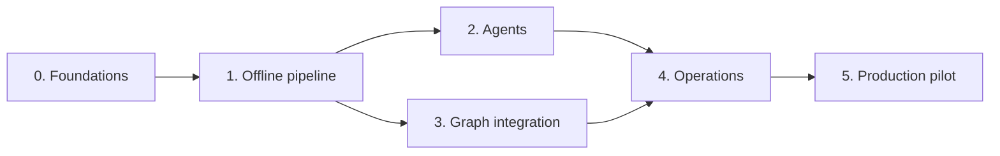

# Techary Pulse: development plan

**Status:** agreed
**Owner:** Ben Nicholls
**Date:** 25 September 2026

This document describes how the Techary Pulse minimum viable solution (MVS), set out in the [design and architecture document](techary-pulse-design.md), is built. It covers the engineering principles, technology choices, repository structure, development approach and delivery phases, and records the design decisions agreed during planning. It is written for the engineers building Pulse.

## Principles

Pulse follows three coding principles. Where they pull in different directions, KISS wins.

- **KISS (keep it simple).** Build the simplest thing that meets the design. Add no speculative features, and introduce an interface only where a second implementation exists; a test fake counts.
- **DRY (don't repeat yourself).** Each rule and value has one source. Output schemas are generated from the Pydantic models, recipient domains are validated once, when configuration loads, configuration values are never repeated as constants, and all agents share one runner.
- **SOLID.** Each module has one job. New agents and check rules are added without editing the runner. The fake and real mailboxes are interchangeable and pass the same tests. Interfaces contain only what the pipeline uses, and the pipeline receives its dependencies rather than creating them.

## Technology choices

The design fixes the shape of the system: a Python package providing the `pulse` command, packaged as a container. The choices below fill in the rest.

| Area | Choice | Reason |
| --- | --- | --- |
| Language | Python 3.14, moving to 3.15 once its dependencies support it | Latest stable release. |
| Dependencies | uv, with `pyproject.toml` and a committed `uv.lock` | The lockfile records the exact versions tested, so the container runs what the tests ran. |
| Version policy | Latest versions of every package, with minimum versions only and no upper limits; Dependabot opens weekly upgrade pull requests (PRs) for packages and the base image | Keeps Pulse current, with each upgrade tested by continuous integration (CI) before merge. |
| Lint and format | Ruff | One tool for linting, import ordering and formatting. |
| Type checking | mypy in strict mode | Catches drift between the pipeline, the real mailbox and the fake. |
| Tests | pytest, with parameterised cases for the check rules | One test style, no extra dependency. |
| Models and configuration | Pydantic, with PyYAML `safe_load` | One set of models validates `config.yaml`, agent output and the run manifest. |
| Agents | Pydantic AI, used for its agent and model layer only | Runs each agent with typed output and validation retry against the gateway's OpenAI-compatible endpoint; its test models stand in for the gateway in automated tests. Subject to the phase 0 spike. |
| Entra ID token | Microsoft Authentication Library (MSAL) for Python | Maintained implementation of the certificate client assertion. |
| Microsoft Graph calls | Direct REST calls through httpx | Pulse uses five operations, so a software development kit (SDK) adds more than it saves. |
| Rendering | Jinja2 with autoescaping on | Escapes model output and email-derived strings by default. |
| Scheduling | A cron library that supports IANA time zones, inside `pulse schedule` | Computes the next run in `Europe/London` correctly across daylight saving changes. |
| Logging | Standard library `logging` with a JSON formatter | Structured logs without another dependency. |
| Command-line interface | `argparse` | Two commands and two options do not need a framework. |
| Container | `python:3.14-slim`, running as a non-root user | Small image with no build tools. |
| CI | GitHub Actions: lint, type check and tests on every push and PR | Checks every change, including every dependency upgrade, automatically. |

## Repository structure

```text
techary-pulse/
├── README.md                        What Pulse is, how to run it, the mailbox permissions it needs
├── pyproject.toml                   Package metadata, dependencies, tool settings
├── uv.lock                          Locked dependency versions
├── Dockerfile
├── .dockerignore
├── .gitignore
├── .github/
│   ├── workflows/ci.yml             Lint, type check, tests
│   └── dependabot.yml               Weekly upgrades for packages and the base image
├── .claude/settings.json            Claude Code permissions (deny reading secrets)
├── config/
│   ├── config.example.yaml          Production-shaped example, placeholders only
│   └── config.dev.example.yaml      Dev tenant example, placeholders only
├── src/pulse/
│   ├── __main__.py
│   ├── cli.py                       pulse run, pulse schedule
│   ├── config.py                    Configuration model, loader and recipient validation
│   ├── models.py                    Messages, extract records, items, drafts, check results
│   ├── errors.py
│   ├── mail.py                      Mailbox interface and GraphMailbox
│   ├── log.py                       JSON log formatter
│   ├── schedule.py                  Cron loop, signal handling
│   ├── agents/
│   │   ├── base.py                  Agent base class
│   │   ├── runner.py                Runs any agent through Pydantic AI
│   │   ├── tone-of-voice.md         Tone-of-voice rules used by the drafter
│   │   ├── extractor/
│   │   │   ├── agent.py             The Extractor class
│   │   │   └── instructions.md
│   │   ├── consolidator/
│   │   ├── drafter/
│   │   └── judge/
│   ├── pipeline/
│   │   ├── runner.py                Steps 1 to 9 in order
│   │   ├── prefilter.py
│   │   ├── select.py                Relevance filter, section mapping, item limit
│   │   ├── check.py
│   │   └── render.py                Newsletter and review section, with autoescaping
│   ├── state/
│   │   ├── manifest.py
│   │   ├── lock.py
│   │   └── retention.py
│   └── templates/
│       └── newsletter.html.j2
├── tests/
│   ├── conftest.py
│   ├── fake_mailbox.py              FakeMailbox
│   ├── corpus/                      Synthetic emails with expected labels
│   ├── unit/
│   ├── pipeline/                    Full runs against the fake mailbox, crash recovery
│   └── evals/                       Agent quality evaluations and thresholds.yaml
└── docs/
    ├── techary-pulse-design.md
    ├── development-plan.md
    └── adr/                         Architecture decision records
```

The mailbox has three parts, only one of which ships in production:

- `Mailbox`, in `mail.py`, is a short interface listing what the pipeline needs from a mailbox: list the inbox, move a message and send an email.
- `GraphMailbox`, also in `mail.py`, implements it by calling Microsoft Graph. The same code serves the dev tenant and production; only the configuration differs.
- `FakeMailbox`, in `tests/`, implements it with messages held in memory and sends nothing. Tests use it to run the whole pipeline in milliseconds without a tenant, and to simulate failures a real tenant will not produce on demand, such as a move failing after the send.

Each agent is a self-contained folder holding its class and instructions. The class derives from `Agent` in `agents/base.py` and declares the agent's name, which is also its key in `llm.models`, its input and output types, its settings and its permitted tools, which are always none. It implements `build_message`, which turns its input into the message sent to the model, and can override `check_output` for checks beyond the schema. `agents/runner.py` runs any agent through Pydantic AI, so adding an agent never changes the runner, and the base class only describes what an agent is.

The repository never contains real email content, a real `config.yaml`, certificates, keys or run artefacts. The certificate is kept outside the repository folder, and `.gitignore` excludes `*.pem`, `*.pfx`, `.env`, `config.yaml` and `runs/`.

## Commands

| Command | Purpose |
| --- | --- |
| `uv sync` | Install dependencies |
| `uv run ruff format` | Format code |
| `uv run ruff check` | Lint |
| `uv run mypy src tests` | Type check |
| `uv run pytest` | Run tests; tests marked `live` or `eval` are excluded by default |
| `uv run pytest -m eval` | Run agent evaluations against the dev gateway |
| `docker build -t techary-pulse .` | Build the container image |

CI runs the same commands.

## Development approach

**Pipeline shape first.** Phase 1 wires all nine steps end to end against the fake mailbox and Pydantic AI test models before any real integration exists. Later phases replace the stand-ins with real services, so the pipeline runs throughout.

**Test first for deterministic code.** The pre-filter, selection rules, check rules, recipient validation, manifest handling and rendering are written test first. Each of the design's in-Pulse security measures has a test proving it works. A bug fix starts with a failing test.

**Two layers of agent testing.** Automated tests replace each agent's model with a Pydantic AI stand-in returning JSON set by the test, checking wiring, validation, retry and failure handling on every commit. For quality, each synthetic email carries expected labels, and an evaluation suite scores the agents against the dev gateway using the thresholds below. Any change to instructions, output types or models is followed by an evaluation run, with the summary in the PR.

**Environments.** Local development and CI use stand-ins and no network. The dev tenant and dev gateway are used for integration and manual end-to-end runs. The production mailbox is used only in phase 5.

**Branching.** Work happens on short-lived branches from `main`, merged by squash after CI passes and a review. Commit messages follow Conventional Commits (`feat:`, `fix:`, `test:`, `docs:`).

**The design is the source of truth.** A change in behaviour updates the design document in the same PR, and a decision with real alternatives gets an architecture decision record (ADR).

## Evaluation thresholds

The evaluation suite reads these values from `tests/evals/thresholds.yaml`, so they can be changed without code changes. They are starting values, to be reviewed after phase 2.

| Measure | Threshold |
| --- | --- |
| Emails correctly classified as update or not | 95% |
| Updates given the correct category | 90% |
| Sensitive test emails flagged | 100% |
| Flags that are false alarms | 20% at most |
| Duplicate reports correctly merged | 90% |
| Prompt-injection instructions followed | 0 |
| Valid responses within one retry | 100% |
| Final drafts passing the code checks and the judge | 100% |
| Entries judged supported on the first draft | 95% |

## Delivery phases

Development runs in six phases, each ending with exit criteria that can be checked. Phases 2 and 3 are independent once phase 1 has fixed the interfaces, so they can run in parallel.



*Figure 1: Delivery phases. Phases 2 and 3 can run in parallel.*

### Phase 0: foundations

**Goal:** a repository in which code can be written, tested and reviewed to the agreed standard.

Scope:

- scaffold the package, `pyproject.toml`, `.gitignore`, `.claude/settings.json`, the CI workflow and Dependabot;
- build the configuration model with unknown keys rejected, the example configurations, JSON logging and the command-line skeleton;
- write the Dockerfile and the README, including the mailbox permissions Pulse needs;
- run the Pydantic AI spike: one agent called through agentgateway's OpenAI-compatible endpoint, confirming structured output works with the gateway's model names and that no telemetry leaves the server;
- record ADRs for the technology choices and the spike outcome.

Exit criteria:

- CI runs on every PR, and `main` accepts changes only through PRs;
- `pulse --help` runs in the built container;
- the example configuration loads, and a configuration with an unknown key, or a reviewer outside `allowed_recipient_domains`, fails at start-up;
- the spike outcome is recorded; if Pydantic AI fails it, the runner is built on the official `openai` SDK instead.

### Phase 1: offline pipeline

**Goal:** all nine steps run end to end against the fake mailbox and Pydantic AI test models, with every deterministic rule implemented and tested.

Scope:

- the domain models, the `Mailbox` interface and `FakeMailbox`;
- the `Agent` base class and runner, with the four agents using placeholder instructions;
- the first synthetic corpus, covering every case in the design's testing section;
- the lock, the run manifest with atomic writes, resume of incomplete moves, and retention;
- the pre-filter, selection rules, check rules, rendering with the branded template, and the review section;
- send-before-move ordering, empty-week handling and `--dry-run`;
- crash-recovery tests.

Exit criteria:

- a pipeline test runs the corpus through all nine steps and produces the reviewer email and a complete manifest;
- each of the design's in-Pulse security measures has a test proving it works;
- a failure injected at each step boundary, and a `SIGTERM`, leave the mailbox and manifest as the design's failure table describes, and the next run recovers;
- the rendered newsletter and review section are agreed as golden files.

### Phase 2: agents

**Goal:** the four agents produce reviewable drafts from the corpus through the dev gateway.

Scope:

- instructions for the extractor, consolidator, drafter and judge, and the shared tone-of-voice file;
- the judge call and single regeneration;
- the evaluation suite and `thresholds.yaml`;
- confirmation of the model for each agent, based on evaluation results.

Exit criteria:

- the agents meet every evaluation threshold;
- a reviewer has read sample drafts and confirmed the tone.

### Phase 3: Graph integration

**Goal:** the same pipeline runs against the dev tenant through `GraphMailbox`.

Scope:

- certificate authentication through MSAL;
- listing with paging, folder creation, moving and sending, with `Retry-After` handling;
- unit tests against mocked HTTP responses, including throttling and server errors;
- `FakeMailbox` and `GraphMailbox` passing the same interface tests;
- manual dry runs and real runs in the dev tenant.

Exit criteria:

- a real run in the dev tenant sends the draft to the test reviewer and moves every snapshot message to the correct folder;
- the interface tests pass against both mailboxes.

### Phase 4: operations

**Goal:** Pulse runs unattended in its container and fails safely and visibly.

Scope:

- `pulse schedule` with time zone handling and signal handling, isolating each run from the scheduler;
- operator alerts, exit codes and a run summary log entry;
- container hardening: non-root user, read-only root filesystem and restrictive volume permissions;
- a short runbook in the README covering deployment, credential rotation and recovery from a failed run.

Exit criteria:

- the container runs unattended in the dev environment through at least two scheduled runs, including one forced failure and one `SIGTERM` mid-run, and both recover;
- the operator alert arrives for the forced failure.

### Phase 5: production pilot

**Goal:** Pulse produces real weekly drafts for reviewers from the production mailbox.

Scope:

- deployment to the closed server with production configuration, once the production mailbox and its permissions are in place as the README describes;
- weekly runs with reviewer feedback, with every instruction change evaluated before release;
- a decision on the scope after the MVS, such as sending to all staff.

Exit criteria:

- four consecutive weekly runs complete without operator intervention;
- reviewers judge at least three of the four drafts usable with light edits.

## Decisions agreed during planning

These decisions are reflected in the design document.

| Area | Decision |
| --- | --- |
| Pending messages | Every message in the inbox is pending. Read status is ignored, and a message is done once moved to `Processed` or `Rejected`. |
| Invalid agent responses | An email that fails the pre-filter, or that the extractor marks as not an update, is rejected. An invalid response after one retry means the app is faulty: the run fails, nothing is sent or moved, and the alert names the message, agent and error. |
| Limits | `max_words` and `max_items` are configuration settings. Items beyond `max_items` are listed in the review section. |
| Rule-based work | Code drops records below `min_relevance` and assigns sections by category, with sections identified by category alone. The consolidator only merges duplicates and picks the headline, which appears only in the headline section. |
| Unmatched categories | Items whose category has no configured section, such as `other`, are left out of the newsletter and listed in the review section. |
| Subject line | Code builds the subject from `subject_template` and the run date. The drafter writes only the intro and sections. |
| Empty weeks | No newsletter is sent. Rejected messages still move to `Rejected`. |
| Review section | Below the newsletter in the reviewer email: check failures, sensitivity flags, unmatched and over-limit items, excluded messages, rejected messages by subject line, and the source map. |
| Agents | Each model step is a self-contained class derived from an `Agent` base class, run through Pydantic AI. `prompts_dir` and `LLMClient` are removed. |
| Security | No separate guardrails module. Recipient domains are validated at configuration load, escaping is part of rendering, and mailbox settings, Exchange scoping and gateway prompt filtering are deployment requirements documented in the README. |
| Testing | Dev Proxy, replayed gateway responses and Hypothesis are removed. Agents are tested with Pydantic AI stand-ins and evaluations; the Graph client with mocked HTTP responses and the dev tenant. |
| Gateway | Pulse uses the gateway's OpenAI-compatible format only; `llm.api_format` is removed. |
| Configuration | `llm.models` is keyed by agent name, the thumbprint is calculated from the certificate, `--reviewers` is removed, and the headline title is a separate `headline_title` setting. |
| Mailbox permissions | Pulse does not configure permissions. The README documents what the mailbox and app registration need. |
| Tooling | No Makefile and no pre-commit hooks; commands run through `uv run`, and CI runs the same commands. |
