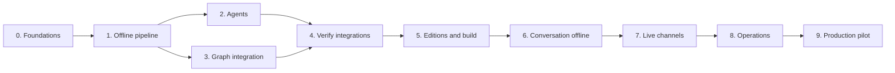

# Techary Pulse: development plan

**Status:** agreed
**Owner:** Ben Nicholls
**Date:** 28 September 2026

This document describes how the Techary Pulse minimum viable solution (MVS), set out in the [design and architecture document](techary-pulse-design.md), is built. It covers the engineering principles, technology choices, repository structure, development approach and delivery phases. Behaviour, and every decision about it, is in the design. It is written for the engineers building Pulse.

Pulse began as a scheduled pipeline that emailed a weekly draft to reviewers. After phase 3, the scope changed to a chat agent that discusses each draft with reviewers over email and LibreChat, revises it and, once approved, sends it to an all-staff distribution list. Phases 0 to 3 built the pipeline, which the new design keeps as its build workflow, and phase 4 prepared the dev environment for the new design; phases 5 to 9 cover the rest.

## Principles

Pulse follows three coding principles. Where they pull in different directions, KISS wins.

- **KISS (keep it simple).** Build the simplest thing that meets the design. Add no speculative features, and introduce an interface only where a second implementation exists; a test fake counts.
- **DRY (don't repeat yourself).** Every rule, value and definition has one authoritative place in the code. Write logic once and call it wherever it is needed, and derive anything that can be derived, such as a schema from its model, instead of keeping a second copy.
- **SOLID.** Each module has one job. New pipeline agents and check rules are added without editing the runner. The fake and real mailboxes are interchangeable and pass the same tests. Interfaces contain only what Pulse uses, and components receive their dependencies rather than creating them.

## Technology choices

The design fixes the shape of the system: a Python package providing the `pulse` command, packaged as a container. The choices below fill in the rest.

| Area | Choice | Reason |
| --- | --- | --- |
| Language | Python 3.14, moving to 3.15 once its dependencies support it | Latest stable release. |
| Dependencies | uv, with `pyproject.toml` and a committed `uv.lock` | The lockfile records the exact versions tested, so the container runs what the tests ran. |
| Version policy | Latest versions of every package, with minimum versions only and no upper limits; upgrade with `uv lock --upgrade`, then run the checks, at the start of each phase | Keeps Pulse current, with each upgrade checked before it is committed. |
| Lint and format | Ruff | One tool for linting, import ordering and formatting. |
| Type checking | mypy in strict mode | Catches drift between components, the real mailbox and the fake. |
| Tests | pytest, with parameterised cases for the check rules, and the AnyIO pytest plugin for asynchronous tests | One test style. The AnyIO plugin ships with AnyIO, already installed as an httpx dependency, so it adds no package. |
| Concurrency | asyncio throughout: one event loop runs the chat endpoint, the scheduler, polling, the periodic check and builds. Pure steps (rules, check, render) stay plain functions. | Pulse is a long-running service doing several input and output tasks at once, and Pydantic AI and httpx are built for asynchronous use. One concurrency model avoids sharing SQLite connections or event loops between threads, gives `SIGTERM` defined cancellation points, and makes the per-edition lock an `asyncio.Lock`. MSAL and `sqlite3` are synchronous, so their calls run through `asyncio.to_thread`; the token is cached and store writes are short. |
| Models and configuration | Pydantic, with PyYAML `safe_load` | One set of models validates `config.yaml`, agent output, the run manifest and chat endpoint requests. |
| Pipeline agents | `pydantic-ai-slim[openai]`, used for its agent and model layer only, in native output mode | Runs each agent with typed output and validation retry against the gateway's OpenAI-compatible endpoint, independent of the provider behind it; its test models stand in for the gateway in automated tests. Tested against the dev gateway in phase 0: native mode sends no tools, output types limited to schema features every major provider supports are accepted, Pydantic AI validates each reply, and requests go only to the gateway. Set `PYDANTIC_AI_NO_BANNER=1`, and use `httpx2` clients for any client passed to Pydantic AI. |
| Chat agent | Pydantic AI, with function tools and `ModelMessagesTypeAdapter` for history | The design names it, and `FunctionModel` lets tests script the tool calls. Tested against the dev gateway in phase 4 with the model the pipeline agents use: tool calls and results pass through, dependencies reach the tool, history round-trips unchanged through `ModelMessagesTypeAdapter` and a follow-up run answers from it, and requests go only to the gateway. |
| Chat endpoint | FastAPI | LibreChat reaches Pulse as an OpenAI-compatible model through agentgateway, so Pulse serves the chat completions route. FastAPI validates requests and responses against Pydantic models and supports streamed responses. Pydantic AI's own adapters speak AG-UI, Vercel AI and A2A, not the chat completions format. |
| Web server | Uvicorn | FastAPI needs an ASGI (Asynchronous Server Gateway Interface) server to accept connections. Uvicorn is the server FastAPI is built and documented around, and it runs as a task inside `pulse serve`, on the same event loop as the scheduler. |
| Gateway credential to Pulse | agentgateway's `backendAuth` policy with a static key on the Pulse backend | agentgateway sends the key as `Authorization: Bearer <key>`, as it does for a provider, and Pulse compares it with the value in `chat.gateway_key_env`. See [agentgateway backend authentication](https://agentgateway.dev/docs/standalone/latest/configuration/security/backend-authn/). |
| Edition store | Standard library `sqlite3`, one transaction per write, file mode `0600` | No extra dependency, and SQLite is what the design specifies. |
| Entra ID token | Microsoft Authentication Library (MSAL) for Python | Maintained implementation of the certificate client assertion. |
| Microsoft Graph calls | Direct REST calls through httpx's asynchronous client | Pulse uses a handful of operations, so a software development kit (SDK) adds more than it saves. |
| Rendering | Jinja2 with autoescaping on | Escapes model output and email-derived strings by default. |
| Scheduling | A cron library that supports IANA time zones, inside `pulse serve` | Computes the next build in `Europe/London` correctly across daylight saving changes. Chosen in phase 7. |
| Logging | Standard library `logging` with a JSON formatter | Structured logs without another dependency. |
| Command-line interface | `argparse` | Two commands and two options do not need a framework. |
| Container | `python:3.14-slim`, running as a non-root user | Small image with no build tools. |

## Repository structure

```text
techary-pulse/
├── README.md                        What Pulse is, how to run it, the permissions and gateway set-up it needs
├── pyproject.toml                   Package metadata, dependencies, tool settings
├── uv.lock                          Locked dependency versions
├── .python-version                  Python version for uv, matching the container
├── Dockerfile
├── .dockerignore
├── .gitignore
├── .claude/settings.json            Claude Code permissions (deny reading secrets)
├── config/
│   ├── config.example.yaml          Production-shaped example, placeholders only
│   └── config.dev.example.yaml      Dev tenant example, placeholders only
├── src/pulse/
│   ├── __main__.py
│   ├── cli.py                       pulse build, pulse serve
│   ├── config.py                    Configuration model, loader and recipient validation
│   ├── models.py                    Messages, extract records, items, drafts, check results
│   ├── errors.py
│   ├── mail.py                      Mailbox interface and GraphMailbox
│   ├── log.py                       JSON log formatter
│   ├── serve.py                     Scheduler, chat endpoint start-up, signal handling
│   ├── store.py                     Edition store
│   ├── editions.py                  Edition transitions, send time and expiry rules
│   ├── periodic.py                  Periodic check: send and expire
│   ├── state.py                     Build lock, build manifest and artefacts, retention
│   ├── conversation/
│   │   ├── runner.py                One chat agent run: edition lock, history in and out
│   │   ├── email.py                 Email channel: poll, reviewer and automatic-reply checks, reply in thread
│   │   └── endpoint.py              LibreChat channel: chat completions route
│   ├── agents/
│   │   ├── base.py                  Agent base class for pipeline agents
│   │   ├── runner.py                Runs any pipeline agent through Pydantic AI
│   │   ├── extractor.py             Extractor class, with its instructions
│   │   ├── consolidator.py
│   │   ├── drafter.py
│   │   ├── judge.py
│   │   ├── reviser.py
│   │   └── chat.py                  Chat agent, its instructions and its seven tools
│   ├── pipeline/
│   │   ├── runner.py                Build workflow, steps 1 to 9 in order
│   │   ├── rules.py                 Pre-filter, exclusions and section order
│   │   ├── check.py
│   │   └── render.py                Reviewer email and newsletter, with autoescaping
│   └── templates/
│       └── newsletter.html.j2
├── tests/
│   ├── conftest.py
│   ├── support.py                   FakeMailbox, stand-in models, message builders
│   ├── corpus/                      Synthetic emails
│   ├── golden/                      Rendered emails for comparison
│   ├── unit/
│   ├── pipeline/                    Full builds against the fake mailbox, crash recovery
│   └── conversation/                Chat agent runs against scripted models and fake mailboxes
└── docs/
    ├── techary-pulse-design.md
    └── development-plan.md
```

The mailbox has three parts, only one of which ships in production:

- `Mailbox`, in `mail.py`, is a short interface listing what Pulse needs from a mailbox: list the inbox, move a message, send an email and reply in a thread. The submissions mailbox uses only listing and moving.
- `GraphMailbox`, also in `mail.py`, implements it by calling Microsoft Graph. Pulse creates one per mailbox address. The same code serves the dev tenant and production; only the configuration differs.
- `FakeMailbox`, in `tests/`, implements it with messages held in memory and sends nothing. Tests use one per mailbox to run builds and conversations in milliseconds without a tenant, and to simulate failures a real tenant will not produce on demand, such as a move failing after the send.

Each pipeline agent is one file holding its class, including its instructions. The class derives from `Agent` in `agents/base.py` and declares the agent's name, which is also its key in `llm.models`, its input and output types, its settings and its permitted tools, which are always none. It implements `build_message`, which turns its input into the message sent to the model, and can override `check_output` for checks beyond the schema. `agents/runner.py` runs any pipeline agent through Pydantic AI, so adding one never changes the runner. The chat agent, in `agents/chat.py`, is a separate Pydantic AI agent with the tools listed in the design; its tools receive the caller, the reviewer's message and the edition through dependencies, never through tool arguments.

The repository never contains real email content, a real `config.yaml`, certificates, keys, run artefacts or the edition store. The certificate is kept outside the repository folder, and `.gitignore` excludes `*.pem`, `*.pfx`, `.env`, `config.yaml`, `runs/` and `state/`.

## Commands

| Command | Purpose |
| --- | --- |
| `uv sync` | Install dependencies |
| `uv run ruff format` | Format code |
| `uv run ruff check` | Lint |
| `uv run mypy src tests` | Type check |
| `uv run pytest` | Run tests; tests marked `live` are excluded by default |
| `uv run --env-file .env pytest -m live -s` | Run the synthetic emails through the agents on the dev gateway, as a dry run, and print where the reviewer email is saved |
| `uv run --env-file .env pulse build --dry-run` | Run one build locally with `./config.yaml` and the credentials in `./.env` |
| `uv run --env-file .env pulse serve` | Run the scheduler and chat endpoint locally |
| `docker build -t techary-pulse .` | Build the container image |

Run format, lint, type check and tests before every commit.

## Development approach

**Offline first.** Each capability runs end to end against fakes and Pydantic AI test models before any real integration exists. Phase 1 did this for the pipeline, and phases 5 and 6 do it for editions and the conversation. Later phases replace the stand-ins with real services, so the code runs throughout.

**Test first for deterministic code.** The pre-filter, selection rules, check rules, recipient validation, manifest handling, edition transitions, approval checks, send timing and rendering are written test first. A bug fix starts with a failing test.

**Agent testing.** Automated tests replace each pipeline agent's model with a Pydantic AI stand-in returning JSON set by the test, and the chat agent's model with a stand-in that calls tools in an order set by the test. They check wiring, validation, retry, tool refusals and failure handling on every commit. Draft and reply quality is judged by reviewers, as the design intends.

**Environments.** Automated tests use stand-ins and no network. Where configuration, credentials and the certificate live on the server and in local development is set out in the README. The dev tenant, dev gateway and proof-of-concept LibreChat are used for integration and manual end-to-end runs. The production mailboxes are used only in phase 9.

**Run it as documented.** Passing tests is not enough to finish a phase. Each phase ends with Pulse run the way the README documents, with a real configuration, so that anything the README leaves out shows up before the phase closes.

**The design is the source of truth.** A change in behaviour updates the design document in the same change, and a change of technology updates the technology choices table in this plan.

## Changes from the scheduled pipeline

Phases 5 to 7 change code built in phases 0 to 3. The table lists each existing module and what happens to it.

| Module | Outcome | Change |
| --- | --- | --- |
| `pipeline/rules.py` | Keep | None. The automatic-reply rule is reused for the conversation mailbox. |
| `agents/extractor.py`, `consolidator.py`, `drafter.py` | Keep | Code adds received dates to items as well as sender names. |
| `agents/judge.py` | Change | Also receives edition feedback as a source. |
| `agents/base.py` | Keep | Remains the base class for pipeline agents. |
| `agents/runner.py` | Change | Becomes asynchronous; its private event loop is removed. |
| `pipeline/check.py` | Change | Reviewer feedback counts as a source for digits and names, and entries must reference included items. |
| `pipeline/render.py`, template | Change | `Draft v{version}:` subject prefix, `{date}` in place of `{week_ending}`, the changes and not-applied part of the review section, received dates in the source map, and a variant without the review section for all staff. Golden files are updated deliberately. |
| `pipeline/runner.py` | Change | Becomes the asynchronous build workflow: get-or-create, `build.lock`, completing moves for a saved edition, and step 8 sending before saving the edition. |
| `state.py` | Keep | Lock file renamed to `build.lock`. |
| `mail.py` | Change | Asynchronous, one `GraphMailbox` per mailbox address, and a reply-in-thread operation. |
| `config.py` | Change | New and renamed sections, listed in [phase 5](#phase-5-editions-and-build-workflow). |
| `cli.py` | Change | `pulse run` becomes `pulse build`; `pulse schedule` becomes `pulse serve`. |
| `tests/support.py` | Change | `FakeMailbox` becomes asynchronous and gains reply. |

## Delivery phases

Development runs in ten phases, each ending with exit criteria that can be checked. Phases 0 to 4 are complete.


```mermaid
flowchart LR
    P0["0. Foundations"] --> P1["1. Offline pipeline"]
    P1 --> P2["2. Agents"]
    P1 --> P3["3. Graph integration"]
    P2 --> P4["4. Verify integrations"]
    P3 --> P4
    P4 --> P5["5. Editions and build"]
    P5 --> P6["6. Conversation offline"]
    P6 --> P7["7. Live channels"]
    P7 --> P8["8. Operations"]
    P8 --> P9["9. Production pilot"]
```

*Figure 1: Delivery phases. Phases 0 to 4 are complete.*

### Phase 0: foundations (complete)

The package, configuration model, example configurations, JSON logging, command-line skeleton, Dockerfile and README. Pydantic AI was tested against the dev gateway through agentgateway's OpenAI-compatible endpoint, confirming structured output, that no tools are sent and that no telemetry leaves the server.

### Phase 1: offline pipeline (complete)

All nine pipeline steps, run end to end against the fake mailbox and Pydantic AI test models, with every deterministic rule tested: the lock and resume, snapshot, pre-filter, exclusions, consolidation checks, draft checks and regeneration, rendering with golden files, send and move ordering, empty weeks, validation retry, crash recovery at each step boundary, and run artefacts.

### Phase 2: agents (complete)

Instructions for the extractor, consolidator, drafter and judge, and a `live` test running the corpus through the agents on the dev gateway.

### Phase 3: Graph integration (complete)

`GraphMailbox` with certificate authentication through MSAL, the list, find folder, create folder, move and send operations, immutable IDs, paging and throttling, tested against mocked HTTP and passing the same interface tests as `FakeMailbox`, with real runs in the dev tenant.

### Phase 4: verify integrations (complete)

**Goal:** the dev environment set up for the chat agent design, and the chat agent's tool calls shown to work through the gateway before code depends on them.

Scope:

- upgrade every dependency with `uv lock --upgrade`, then run the checks;
- update the README's description of Pulse to the chat agent design;
- create the conversation shared mailbox, unlicensed, requiring senders to be authenticated as in production;
- create the test distribution list, standing in for the all-staff list, with closed membership and the test user as its only member, accepting mail only from the conversation mailbox and an administrator;
- widen the Exchange management scope from the phase 3 set-up to match both Pulse mailboxes, extending the existing role assignments;
- **check 1, chat agent tools:** a throwaway Pydantic AI agent with one tool, called through the dev gateway with the model the pipeline agents use, confirming tool calls work, dependencies reach the tool, history round-trips through `ModelMessagesTypeAdapter`, and requests go only to the gateway.

The gateway route to Pulse and replying in a thread were planned as phase 4 checks, and moved to phase 7, where they are tested live.

Exit criteria:

- format, lint, type check and tests pass after the upgrade;
- the management scope's stored filter names exactly the two Pulse mailboxes, and `Test-ServicePrincipalAuthorization`, run against every mailbox in the tenant, shows the app's two roles apply to those two mailboxes and no others;
- mail to the test distribution list from the test user is rejected, and mail from the administrator is delivered;
- the check 1 result is recorded in the technology choices table;
- check code is deleted, not merged.

### Phase 5: editions and build workflow

**Goal:** the build workflow runs asynchronously and creates editions in the edition store, against fakes.

Scope, from the design's editions, build workflow and edition store sections:

- **Asynchronous conversion:** `GraphMailbox`, `FakeMailbox`, the agent runner and the pipeline runner made asynchronous, with the existing tests passing before any behaviour changes.
- **Configuration:** `mailboxes`, `all_staff`, top-level `timezone`, `schedule.build_cron` (optional) and `poll_interval_minutes`, `send`, `edition.expire_after_days`, `chat`, `state.db_path`, and `chat` and `reviser` in `llm.models`; `all_staff` validated against `allowed_recipient_domains`; example configurations and `.gitignore` updated.
- **Edition store:** the six tables, transactions, file mode, and deleting closed editions older than `retention_days`.
- **Editions:** the state machine and its transitions, including withdrawal, as pure functions; send time in both send modes; expiry.
- **Build workflow:** get-or-create for repeated and concurrent requests, "build in progress" when `build.lock` is held, completing moves for a saved edition even while it is open, received dates on items, item IDs for excluded records, step 8 sending before saving the edition, and the empty-build rules.
- **Rendering:** the reviewer email changes and the all-staff variant listed in [changes from the scheduled pipeline](#changes-from-the-scheduled-pipeline), with golden files updated.
- **Command line:** `pulse build` and `pulse build --dry-run`, replacing `pulse run`.
- **Failure handling:** the build rows of the design's failure table, with a failure injected at each step boundary.

Exit criteria:

- a pipeline test runs the corpus through a build, creates an edition with version 1, and a second request returns the same edition without sending;
- the crash-recovery tests pass against the new failure table;
- `uv run --env-file .env pulse build --dry-run` works against the dev tenant as the README documents.

### Phase 6: conversation offline

**Goal:** the whole review conversation, from feedback to the all-staff send, runs against scripted models, fake mailboxes and a controlled clock.

Scope, from the design's conversation, chat agent, revise and periodic check sections:

- **Reviser:** the agent, its output type and checks, restoring excluded records by item ID, and the check and judge steps treating feedback as a source, with one regeneration.
- **Chat agent:** the seven tools, with the caller, the reviewer's message and the edition passed as dependencies; the `approve` checks, including `approve v{version}` in the reviewer's own message; withdrawal by tool and by revision; each tool recording its effect as it happens; the instruction rules; text output, with no reply allowed in the email channel.
- **Conversation runner:** the per-edition lock, loading history from the store, appending `new_messages()`, runs with no open edition, and appending nothing on failure.
- **Email channel:** polling the conversation inbox, the reviewer and automatic-reply checks, `handled_messages`, reply-all to `reviewers` only carrying any new version, and `chat.max_attempts`.
- **Periodic check:** send timing, the approval re-check, `send_started` and its alert, `replyTo` set to the submissions mailbox, and expiry.

Exit criteria:

- a scenario test runs build, email feedback, revision, approval, withdrawal, a second approval and the periodic check, and asserts one email to `all_staff` containing the approved version;
- tests show that submission text asking for approval cannot record one, and that tool refusals and `send_started` handling behave as designed;
- a test confirms that no code path other than the periodic check can send to `all_staff`.

### Phase 7: live channels

**Goal:** reviewers hold the conversation with the real agent over email and LibreChat in the dev environment.

Scope:

- **Graph:** the reply-in-thread operation in `GraphMailbox`, with mocked HTTP tests, the interface tests run against both mailboxes, and a live reply in the dev tenant confirming it stays in the reviewer's thread and reaches only `reviewers`.
- **Chat endpoint:** the chat completions route on FastAPI, answering streamed and non-streamed requests, with progress notes in streamed responses, the bearer token check and `X-User-Email`; tested live through the dev agentgateway route, confirming the `backendAuth` bearer token and `X-User-Email` arrive as the design expects.
- **`pulse serve`:** Uvicorn, the scheduler polling every `poll_interval_minutes`, the optional build cron and the periodic check, on one event loop.
- **Agent quality:** instructions for the chat agent and reviser, tuned through the dev gateway; the `live` test extended with a scripted reviewer conversation.
- **README:** the local setup for the second mailbox and the chat endpoint.

Exit criteria:

- in the dev environment, following the README, a reviewer requests a draft in LibreChat, gives feedback by email and in LibreChat, approves it, and the test distribution list receives the newsletter once;
- a reviewer has read the revisions and replies and confirmed their quality.

### Phase 8: operations

**Goal:** Pulse runs unattended in its container and fails safely and visibly.

Scope:

- `pulse serve` as the container entrypoint, listening on `chat.port`;
- on `SIGTERM`, finishing the current step or agent run, saving state and exiting;
- operator alerts from the conversation mailbox for every alerting row of the failure table;
- the container reading configuration and the certificate from mounted paths, both gateway credentials from the environment, and writing the edition store and run artefacts to a mounted volume;
- the README's deployment section, including the production requirements in the design: `RequireSenderAuthenticationEnabled` on both mailboxes, the all-staff list's sender restriction, the gateway route to the chat endpoint, and Entra ID sign-in for LibreChat.

Exit criteria:

- the container runs unattended in the dev environment through a scheduled build, an expiry and a scheduled send, including one forced failure and one `SIGTERM` during a build and during a chat run, all of which recover;
- the operator alert arrives for the forced failure;
- the container is set up and run by following the README.

### Phase 9: production pilot

**Goal:** Pulse produces real editions from the production mailboxes and sends approved ones to staff.

Scope:

- deployment to the closed server with production configuration, once the mailboxes, list restrictions, gateway route and LibreChat sign-in are in place as the README describes;
- weekly editions reviewed, approved and sent;
- a decision on the scope after the MVS.

Exit criteria:

- an edition approved by a reviewer is sent from the production conversation mailbox to `all_staff`;
- the production deployment followed the README with no missing steps.
