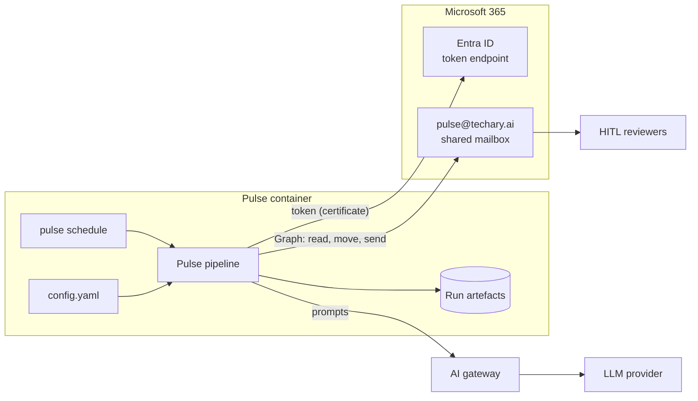
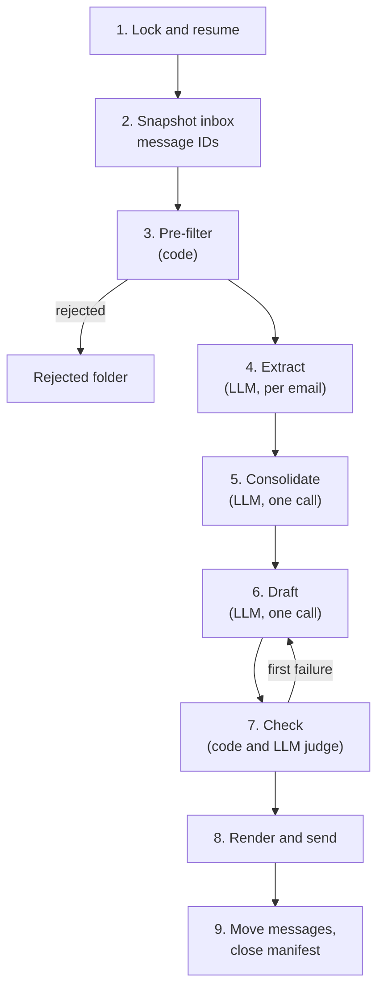

# Techary Pulse: design and architecture (minimum viable solution)

**Status:** draft
**Author:** Ben Nicholls
**Date:** 25 September 2026

Techary Pulse is a scheduled service that turns staff updates emailed to `pulse@techary.ai` into a weekly draft newsletter and emails the draft to human-in-the-loop (HITL) reviewers. This document describes the design of its minimum viable solution (MVS) for the engineers who build and operate it.

## Scope

Any Techary staff member can email updates to `pulse@techary.ai` during the week. Each run reads the emails in the mailbox inbox, filters out anything not from an allowed sender, extracts and consolidates the genuine updates, excludes sensitive and inappropriate content, drafts a newsletter in the Techary tone of voice, and emails the draft to the configured reviewers. Processed emails are then moved out of the inbox. Reviewers send the final newsletter to staff themselves.

The MVS excludes:

- sending the newsletter to all staff, and any approval workflow;
- figures from company systems, such as staff counts, sales and ticket figures, and new customers from Salesforce;
- feedback from reviewers to tune prompts, and evaluation datasets;
- databases, embeddings, vector storage and processing mail more than once a week;
- publishing individual articles;
- targeted mailing lists for individual teams;
- attachment content.

## Environment

Pulse runs as a container on a closed server. The server has outbound access to Microsoft Graph (`graph.microsoft.com`), the Microsoft Entra ID token endpoint (`login.microsoftonline.com`) and an AI gateway, currently agentgateway. It has no access to Azure Storage or other Azure services.

All connections, paths and the schedule are set in configuration. Pulse has no dependency on the host beyond these.

## Architecture

Pulse is a fixed pipeline. Code performs all deterministic work: fetching, filtering, rule enforcement, rendering, sending and moving mail. Model calls perform only classification, extraction, consolidation, drafting and verification, each returning JSON (JavaScript Object Notation) validated against a schema. The model has no tools and cannot affect recipients or which messages are processed.

The pipeline reaches the mailbox through `Mailbox`, a short interface that lists, moves and sends mail. Production uses `GraphMailbox`, which calls Microsoft Graph; automated tests use `FakeMailbox`, which holds test messages in memory.

Each model step is an agent: a self-contained class, derived from a shared `Agent` base class, declaring its instructions, model, input and output types, output checks and permitted tools, which are always none. A shared runner executes any agent through Pydantic AI. Automated tests run the same agents against Pydantic AI's test models instead of the gateway.



*Figure 1: Pulse components and connections.*

| Component | Responsibility |
| --- | --- |
| `pulse run` | Runs the pipeline once and exits. |
| `pulse schedule` | Long-running process that calls `pulse run` on the cron schedule in config. The container entrypoint. |
| `config.yaml` | Mailbox, reviewers, senders, schedule, sections, rules, limits, gateway connection and model names. |
| Agents | One class per model step (extractor, consolidator, drafter, judge), packaged with Pulse. |
| Run artefacts | One directory per run containing fetched messages, intermediate JSON, draft attempts, check results and the run manifest. |
| `pulse@techary.ai` | Shared mailbox. Receives submissions and sends the draft. Holds `Processed` and `Rejected` folders. |
| AI gateway | Receives all model calls from Pulse, holds provider credentials and forwards requests to the provider. |

## Process flow



*Figure 2: Pipeline for one run. Steps 4 to 7 call the model.*

1. **Lock and resume.** Pulse takes an exclusive lock on a lock file; a second concurrent run exits immediately. If the latest run manifest shows a sent draft with incomplete moves, Pulse completes those moves. It then deletes run artefacts older than `retention_days`.
2. **Snapshot.** Pulse lists every message in the inbox and records their IDs in a new run manifest. Read status is ignored: the inbox holds pending messages, and a message is done once it is moved to `Processed` or `Rejected`. Only the snapshot messages are processed and moved in this run.
3. **Pre-filter.** Pulse rejects messages:
   - whose sender domain is not in `allowed_sender_domains`;
   - whose sender is not in `allowed_senders`, when that list is not empty;
   - carrying a sensitivity label whose ID is not in `allowed_sensitivity_labels`, read from the `msip_labels` header; messages with no label are allowed;
   - carrying an `Auto-Submitted` header other than `no`, or an `X-Auto-Response-Suppress` header;
   - with a body shorter than `min_body_chars`.
4. **Extract.** One model call per message, run in parallel, returns an extract record. Code then excludes every record that is not an update, is unclear, has no matching category or carries a sensitivity flag.
5. **Consolidate.** One model call over the remaining extract records merges records describing the same news, writes the headline from the consolidated items and confirms each item's category. Each item lists its source message IDs, and code adds the sender names.
6. **Draft.** One model call writes the newsletter from the consolidated items, following the rules in [draft](#draft). It receives no raw email content and returns structured sections, not HTML.
7. **Check.** Code checks the draft against the rules in [check](#check), and a judge call verifies each sentence against its source items. On failure, Pulse regenerates the draft once with the failure reasons. If the second draft also fails, it is sent with the failures listed first in the review section.
8. **Render and send.** Pulse builds the subject from `subject_template` and the run date, renders the draft into the HTML template, omitting sections with no entries, appends the review section and sends it from `pulse@techary.ai` to `reviewers`, with `replyTo` set to `reviewers`. The manifest records the send.
9. **Move messages.** Pulse moves included and excluded messages to `Processed` and rejected messages to `Rejected`, creating either folder if absent, and marks the manifest complete. No message is moved before the send succeeds.

If no items remain after step 5, no newsletter is sent. Rejected messages are still moved to `Rejected`, all other messages stay in the inbox, and the run is logged.

## Model steps

Each step is an agent packaged with Pulse. Its instructions are held in a Markdown file beside the agent's class, and the drafter also uses a shared tone-of-voice file. The extractor's instructions include each configured section's category and definition. The model for each step comes from `llm.models` in config, keyed by agent name; configuration fails to load if an agent has no model entry or an entry names no agent.

Pulse validates every response against the agent's output type, and an invalid response is retried once. A second invalid response for a message that passed the pre-filter means the instructions, output type or model are faulty: the run fails, nothing is sent or moved, and the operator alert names the message, the agent and the validation error.

| Step | Agent | Calls per run | Input | Model tier |
| --- | --- | --- | --- | --- |
| Extract | `extractor` | One per message | One cleaned email | Small |
| Consolidate | `consolidator` | One | Extract records that were not excluded | Mid |
| Draft | `drafter` | One, plus at most one regeneration | Consolidated items, tone rules | Mid |
| Judge | `judge` | One per draft | Draft and consolidated items | Mid |

### Gateway connection

Pulse sends every model call to `llm.base_url` in the OpenAI-compatible chat completions format that the gateway exposes, whichever provider sits behind it. The gateway credential is read from the environment variable named in `llm.api_key_env`. Model names in config are the names the gateway exposes. Pulse holds no provider credentials.

### Extract

```json
{
  "message_id": "AAkALgAAAAAAHYQDEapmEc2byACqAC-EWg0A...",
  "is_update": true,
  "exclusion_reason": null,
  "category": "customer_win",
  "summary": "Sales signed a managed service contract with a new retail customer.",
  "facts": [
    "Contract signed on 22 September 2026",
    "Onboarding starts in October"
  ],
  "people": ["Priya Shah", "Tom Evans"],
  "sensitivity": [
    {"type": "commercial", "evidence": "mentions annual contract value"}
  ]
}
```

| Field | Values |
| --- | --- |
| `is_update` | `false` for out-of-office and other automatic replies, test emails, one-word messages, newsletters and mailing-list mail |
| `exclusion_reason` | `not_an_update`, `unclear` (the facts cannot be stated without assumptions) or `no_matching_section` (the update fits none of the configured category definitions); `null` for an included record |
| `category` | One of the configured section categories; `null` for an excluded record |
| `sensitivity.type` | `commercial` (deal values, margins, pricing, revenue), `personal` (health, family, performance, HR matters), `unannounced` (confidential, draft or not yet announced) or `inappropriate` (offensive, discriminatory or harassing content, profanity, criticism of named colleagues or customers) |

The model extracts only facts stated in the message. Categories and their definitions are set in `sections` in config, and the starting set is shown in [configuration](#configuration).

Excluded records appear in the review section with their reason or sensitivity evidence.

### Consolidate

```json
{
  "headline": "A new retail customer and a thank-you to the service desk",
  "items": [
    {
      "item_id": "item-2",
      "category": "customer_win",
      "facts": ["Contract signed on 22 September 2026", "Onboarding starts in October"],
      "people": ["Priya Shah", "Tom Evans"],
      "source_message_ids": ["AAkALg...01", "AAkALg...07"]
    }
  ]
}
```

The model returns `source_message_ids` for each item, because only it knows which records it merged; code checks that every ID came from its input and adds each item's sender names. Where merged records have different categories, the consolidator chooses one. The headline is one short line written from the consolidated items.

### Draft

```json
{
  "intro": "A strong week for new customers and some well-earned thanks.",
  "sections": [
    {
      "category": "customer_win",
      "entries": [
        {"item_id": "item-2", "text": "Priya Shah and Tom Evans signed our newest retail customer, with onboarding starting in October.", "people": ["Priya Shah", "Tom Evans"]}
      ]
    }
  ]
}
```

Code renders the consolidator's headline under `headline_title`, then each section under its configured title, in config order. The draft has no subject: code builds it from `subject_template`. The drafter's instructions apply these rules:

- each entry is one or two sentences;
- each entry names every sender of its item, and lists every person it names in `people`;
- entries use only the facts of their item, with no figures beyond those facts;
- the newsletter is under `max_words` words;
- language is everyday, genuine and people-focused, with no jargon or hype words;
- the tone is warm and professional, celebrating people by name;
- British English, with no em dashes or en dashes.

### Check

Code verifies that:

- the rendered newsletter, excluding the review section, is at most `max_words` words;
- no em dashes or en dashes appear (code replaces them before the other checks);
- every number in the draft appears in a source message;
- every name in an entry's `people` appears in the entry's text, and in a source message or the item's sender names;
- every entry is at most two sentences;
- every entry names every sender of its item;
- every entry references an existing `item_id`, and every included item appears exactly once;
- only configured categories appear.

The judge call returns, for each entry, whether its text is supported by the facts of its item.

### Reviewer email

The reviewer email contains the rendered newsletter followed by a review section listing, in order:

1. check failures;
2. messages excluded for sensitivity, with sender, subject, sensitivity type and evidence;
3. other excluded messages, with sender, subject and reason;
4. rejected messages, by subject line only;
5. messages with attachments, whose attachment content is not included;
6. the source map, linking each item to its source messages by sender and subject.

## Microsoft Graph integration

Pulse authenticates as an Entra ID application using the OAuth 2.0 client credentials flow with a certificate. The file at `graph.certificate_path` holds the certificate and its private key; Pulse calculates the certificate thumbprint from it at start-up, passes it to MSAL (Microsoft Authentication Library) and logs it, so an operator can match it against the app registration. The app has no Mail permissions in Entra ID. Its mail access is granted in Exchange Online through RBAC (role-based access control) for Applications, scoped to the Pulse mailbox:

| Exchange application role | Scope | Used for |
| --- | --- | --- |
| `Application Mail.ReadWrite` | Pulse mailbox | Reading, moving and creating folders |
| `Application Mail.Send` | Pulse mailbox | Sending the draft |

The scoping consists of an Exchange service principal for the app, a management scope matching only the Pulse mailbox, and one role assignment per role within that scope.

| Operation | Request |
| --- | --- |
| Get token | `POST https://login.microsoftonline.com/{tenant-id}/oauth2/v2.0/token`, scope `https://graph.microsoft.com/.default`, signed client assertion |
| List inbox | `GET /users/pulse@techary.ai/mailFolders/inbox/messages?$select=id,from,sender,subject,receivedDateTime,uniqueBody,internetMessageHeaders,hasAttachments&$top=50` |
| Create folder | `POST /users/pulse@techary.ai/mailFolders` |
| Move | `POST /users/pulse@techary.ai/messages/{id}/move`, body `{"destinationId": "<folder-id>"}` |
| Send | `POST /users/pulse@techary.ai/sendMail`, with `replyTo` |

Every request sends `Prefer: IdType="ImmutableId"`, so message IDs stay the same when messages move folders. List requests also send `Prefer: outlook.body-content-type="text"`, so bodies are returned as plain text. `uniqueBody` contains only the new content of a message, without quoted replies, and `internetMessageHeaders` supplies the headers used by the pre-filter. Pulse follows `@odata.nextLink` for paging and sorts results in code.

## Security

Pulse's security comes from two places: how the pipeline is built, and how it is deployed.

Within Pulse:

- recipients come only from `config.yaml`, and are validated against `allowed_recipient_domains` when configuration loads, so a mistyped or external address stops Pulse at start-up;
- the pre-filter rejects senders outside `allowed_sender_domains`, and outside `allowed_senders` when that list is not empty, and messages whose sensitivity label is not allowed;
- the extractor flags sensitive and inappropriate content, and code excludes every flagged record from the draft;
- agents have no tools, so model output cannot send mail, move messages or choose recipients;
- the drafter receives only extracted facts, and the check step verifies names and numbers against the source messages;
- rendering escapes all model output and email-derived text;
- every draft goes to reviewers with exclusions, sensitivity evidence and the source map, and the MVS sends only to `reviewers`.

Deployment requirements, documented in the README and outside the codebase:

- the production mailbox is configured with `RequireSenderAuthenticationEnabled`, so Exchange rejects mail from unauthenticated or external senders;
- Exchange scoping, described in [Microsoft Graph integration](#microsoft-graph-integration), limits the app to the Pulse mailbox;
- prompt filtering is applied at the AI gateway if the gateway provides it.

## Failure handling and observability

The run manifest records the snapshot of message IDs, the outcome for each message, the send status and completed moves.

| Failure point | Behaviour |
| --- | --- |
| Before the send | Nothing is sent or moved. The next run processes the same messages. |
| Invalid model response after one retry | The run fails before the send. The operator alert names the message, the agent and the validation error. |
| During the send | No messages are moved. A retry may send a second draft to reviewers. |
| After the send, during moves | The next run completes the moves before processing anything else. |
| SIGTERM | Pulse stops at the next step boundary and exits. The manifest records progress. |
| Graph HTTP 429 | Pulse waits for the `Retry-After` interval and retries, up to `graph.max_retries`. |

Each run writes its artefacts to a dated directory under `run_artefacts_dir`, readable only by the account Pulse runs as. Logs are structured JSON on standard output. A failed run sends an alert from the Pulse mailbox to `operator_alerts`.

`pulse run` accepts `--dry-run`, which runs every step without sending or moving.

## Packaging

The repository produces a Python package providing the `pulse` command, and a container image built from that package with `pulse schedule` as its entrypoint. The container reads `config.yaml` from a mounted path, takes the gateway credential from an environment variable, reads the certificate from a mounted path, writes artefacts to a mounted volume and logs to standard output.

## Configuration

```yaml
graph:
  tenant_id: <tenant-id>
  client_id: <client-id>
  certificate_path: /run/secrets/pulse.pem
  max_retries: 5

mailbox:
  address: pulse@techary.ai
  processed_folder: Processed
  rejected_folder: Rejected

reviewers:
  - <reviewer>@techary.ai

operator_alerts:
  - <operator>@techary.ai

allowed_sender_domains:
  - techary.ai
allowed_senders: []
allowed_recipient_domains:
  - techary.ai
allowed_sensitivity_labels:
  - <label-id>

schedule:
  cron: "30 17 * * FRI"
  timezone: Europe/London

limits:
  max_messages_per_run: 200
  min_body_chars: 20
  max_words: 400

subject_template: "Pulse: week ending {week_ending}"

headline_title: "Headline of the week"

sections:
  - category: customer_win
    title: "Customer wins"
    definition: "A new customer has signed, or an existing customer has renewed or expanded their contract."
  - category: delivery_highlight
    title: "Delivery highlights"
    definition: "A project, service or milestone has been delivered, launched or completed for a customer."
  - category: team_news
    title: "Team news and new joiners"
    definition: "Someone has joined, moved role or gained a qualification, or a team has reached a milestone or held an event."
  - category: shout_out
    title: "Shout-outs"
    definition: "A named colleague is being thanked or recognised for their work."

llm:
  base_url: http://localhost:3000
  api_key_env: PULSE_LLM_API_KEY
  models:
    extractor: <gateway-model-name>
    consolidator: <gateway-model-name>
    drafter: <gateway-model-name>
    judge: <gateway-model-name>

run_artefacts_dir: ./runs
retention_days: 90
```

## Development and testing

Development runs against a Microsoft 365 dev tenant with Exchange Online, separate from Techary's production tenant. Pulse uses the same `GraphMailbox` as production, with dev tenant values in config. The dev tenant contains:

| Object | Purpose |
| --- | --- |
| Shared mailbox | Receives submissions and sends the draft. Unlicensed. |
| Licensed test user | Internal sender and sole reviewer. |
| App registration | Pulse's identity, authenticated by a certificate whose private key stays in the development workspace. |
| Exchange scoping | Service principal, management scope and role assignments limiting the app to the shared mailbox. |

The dev mailbox accepts external senders, and the dev config adds the Techary work domain to `allowed_sender_domains`, so submissions can be sent from Techary work accounts. `reviewers` and `allowed_recipient_domains` are limited to the test user and the dev tenant domain.

Automated tests run without a tenant or gateway:

| Layer | Scope | Method |
| --- | --- | --- |
| Automated tests, every commit | Pre-filter, extract to check, recipient validation, send and move ordering, crash recovery, agent validation and retry | `FakeMailbox`, with each agent's model replaced by a Pydantic AI stand-in returning JSON set by the test |
| Graph client, every commit | Requests, paging, throttling, errors | Mocked HTTP responses, including injected errors |

The synthetic corpus contains genuine updates for every section, duplicate reports of the same news, out-of-office replies, test emails, one-word messages, newsletters, unclear submissions, updates that fit no category, external senders, labelled messages, sensitive and inappropriate content, messages with attachments, long reply chains, empty messages and a prompt-injection attempt.

## Glossary

| Term | Meaning |
| --- | --- |
| Agent | Self-contained class for one model step, declaring its instructions, model, input and output types, output checks and permitted tools. |
| AI gateway | Proxy between Pulse and model providers that holds provider credentials and forwards requests. |
| Fake mailbox | Test stand-in for the mailbox that holds messages in memory and sends nothing. |
| HITL | Human in the loop: a person who reviews output before it takes effect. |
| Immutable ID | Graph message ID that stays the same when a message moves folders. |
| LLM | Large language model. |
| Microsoft Graph | Microsoft's API (application programming interface) for Microsoft 365 data, including mail. |
| Model as judge | A model call that assesses another model call's output against stated criteria. |
| Prompt injection | Text in an input that attempts to override a model's instructions. |
| RBAC for Applications | Exchange Online feature that limits an application's mail permissions to specific mailboxes. |
| Run manifest | JSON file per run recording processed messages and run progress. |
| Sensitivity label | Microsoft Purview classification applied to a message, carried in its `msip_labels` header and identified by its label ID. |
